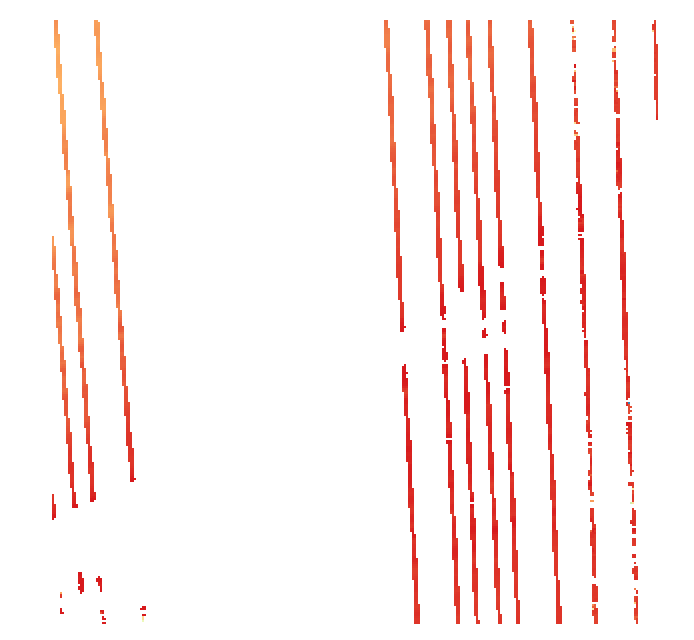

**LAS Output**

A basic pipeline to export the points into LAS format:

```
[
    {
      "type": "readers.ept",
      "filename": "http://s3-us-west-2.amazonaws.com/access-icesat2-entwine/1/ept.json",
      "bounds": "([655000, 1125000], [820000, 1760000])"
    },
    {
      "type": "writers.las",
      "filename": "./output.las"
    }
]
```
[las_output.json](pipelines/las_output.json)

The above pipeline has:
- Reader stage that points to the Cycle 1 EPT endpoint and limits to a set of bounds as the input
- Writer stage that indicates the output will be written in the LAS format and will have a filename of `output.las`

**Raster Output**

To export instead as a raster, just change the Writer stage:
```
[
    {
      "type": "readers.ept",
      "filename": "http://s3-us-west-2.amazonaws.com/access-icesat2-entwine/1/ept.json",
      "bounds": "([650000, 700000], [1100000, 1150000])"
    },
    {
        "filename":"./output.tiff",
        "gdaldriver":"GTiff",
        "output_type":"all",
        "resolution":"100.0",
        "type": "writers.gdal"
    }
]
```
[tiff_output.json](pipelines/tiff_output.json)

*Note: You will need to specify a resolution value that is in the units of the underlying projection.*

Output Raster Image:

