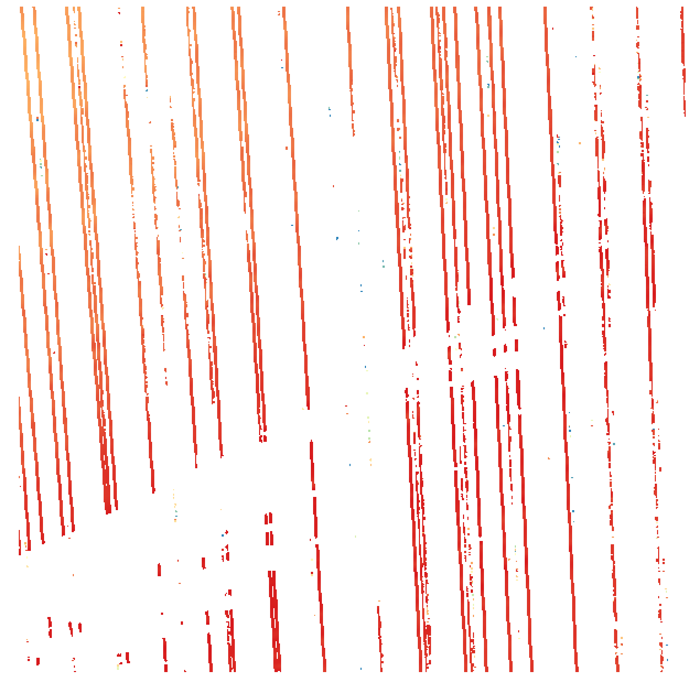

**Merging Data Across Cycles**

To add additional datasets to a pipeline, all you need to do is simply add additional reader stages.  Working from the previous Raster Output example, by adding an additional reader stage pointing to the Cycle 2 endpoint, we are able to read in all of the points from both cycles and output the aggregation into a single output TIFF.

```
[
    {
      "type": "readers.ept",
      "filename": "http://s3-us-west-2.amazonaws.com/access-icesat2-entwine/1/ept.json",
      "bounds": "([650000, 700000], [1100000, 1150000])"
    },
    {
      "type": "readers.ept",
      "filename": "http://s3-us-west-2.amazonaws.com/access-icesat2-entwine/2/ept.json",
      "bounds": "([650000, 700000], [1100000, 1150000])"
    },
    {
        "filename":"./output.tiff",
        "gdaldriver":"GTiff",
        "output_type":"all",
        "resolution":"100.0",
        "type": "writers.gdal"
    }
]
```
[tiff_merged_output.json](pipelines/tiff_merged_output.json)

Output Raster Image:



Lastly, if you are interested in pulling down all cycles, simply add an additional reader stage for each cycle.
```
[
    {
      "type": "readers.ept",
      "filename": "http://s3-us-west-2.amazonaws.com/access-icesat2-entwine/1/ept.json",
      "bounds": "([650000, 700000], [1100000, 1150000])"
    },
    {
      "type": "readers.ept",
      "filename": "http://s3-us-west-2.amazonaws.com/access-icesat2-entwine/2/ept.json",
      "bounds": "([650000, 700000], [1100000, 1150000])"
    },
    {
      "type": "readers.ept",
      "filename": "http://s3-us-west-2.amazonaws.com/access-icesat2-entwine/3/ept.json",
      "bounds": "([650000, 700000], [1100000, 1150000])"
    },
    {
      "type": "readers.ept",
      "filename": "http://s3-us-west-2.amazonaws.com/access-icesat2-entwine/4/ept.json",
      "bounds": "([650000, 700000], [1100000, 1150000])"
    },
    {
      "type": "readers.ept",
      "filename": "http://s3-us-west-2.amazonaws.com/access-icesat2-entwine/5/ept.json",
      "bounds": "([650000, 700000], [1100000, 1150000])"
    },
    {
      "type": "readers.ept",
      "filename": "http://s3-us-west-2.amazonaws.com/access-icesat2-entwine/6/ept.json",
      "bounds": "([650000, 700000], [1100000, 1150000])"
    },
    {
        "filename":"./tiff_merged_all_output.tiff",
        "gdaldriver":"GTiff",
        "output_type":"all",
        "resolution":"50.0",
        "type": "writers.gdal"
    }
]
```
[tiff_merged_all_output.json](pipelines/tiff_merged_all_output.json)

Output Raster Image:


**Filtering Specific Beams**

As demonstrated in the above examples, the cycle is being used as a rough proxy for temporality.  If instead you are specifically interested in gathering the data from a beam pair, you will need add an additional filter stage.  Within the end point, the `ReturnNumber` property has been mapped to the beam id values.  The mapping is as follows: gt1l > 0, gt1r > 1, gt2l > 2, gt2r > 3, gt3l > 4, gt3r > 5.  In the example below, we will be filtering to the gt1-left/right beam pair.

```
[
    {
      "type": "readers.ept",
      "filename": "http://s3-us-west-2.amazonaws.com/access-icesat2-entwine/1/ept.json",
      "bounds": "([650000, 700000], [1100000, 1150000])"
    },
    {
      "type":"filters.range",
      "limits":"ReturnNumber[0:1]"
    },
    {
        "filename":"./tiff_filtered_output.tiff",
        "gdaldriver":"GTiff",
        "output_type":"all",
        "resolution":"50.0",
        "type": "writers.gdal"
    }
]
```
[tiff_filtered_output.json](pipelines/tiff_filtered_output.json)

*Note: Operations involving filtering will be a bit slower as all points must be inspected for the respective values.*

Output Raster Image:

