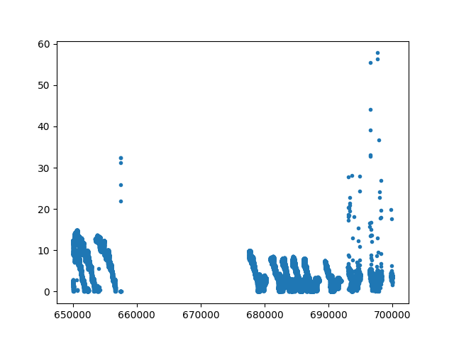

**Perform Python Operations**

Now that we have a good understanding of how to contrain data spatially, filter for points with specific attributes, and output to a variety of formats, it is time to investigate the real meat of interacting with the data!  We will start with a relatively simple python file that simply prints out the names of all attributes of a dataset.
```
# The filters.programmable filter expects a function name in the
# module that has at least two arguments -- "ins" which
# are numpy arrays for each dimension, and the "outs" which
# the script can alter/set/adjust to have them updated for
# further processing.
def print_attributes(ins, outs):
    for key in ins.keys():
        print (key)
```
[print_attributes.py](pipelines/python/print_attributes.py)

Once you have this python script locally, the PDAL Pipeline to invoke it would be:

```
{
    "pipeline": [
        {
          "type": "readers.ept",
          "filename": "http://s3-us-west-2.amazonaws.com/access-icesat2-entwine/1/ept.json",
          "bounds": "([650000, 700000], [1100000, 1150000])"
        },
        {
            "type": "filters.python",
            "function": "print_attributes",
            "module": "anything",
            "script": "./pipelines/print_attributes.py"
        },
        {
            "type": "writers.null"
        }
    ]
}
```
[print_attributes.json](pipelines/print_attributes.json)

Results:

```
X
Y
Z
Intensity
ReturnNumber
NumberOfReturns
ScanDirectionFlag
EdgeOfFlightLine
Classification
ScanAngleRank
UserData
PointSourceId
GpsTime
Red
Green
Blue
ScanChannel
ClassFlags
atl06_quality_summary
h_li_sigma
segment_id
sigma_geo_h
CycleNumber
```

** Python Data Plotting **

Python:
```
import matplotlib.pyplot as plt

def plot_h_li(ins, outs):
  plt.plot(ins['X'], ins['Z'], '.')
  plt.savefig('./plot_h_li.png')
  return True
```
[plot_h_li.py](pipelines/python/plot_h_li.py)

PDAL Pipeline:
```
{
    "pipeline": [
        {
          "type": "readers.ept",
          "filename": "http://s3-us-west-2.amazonaws.com/access-icesat2-entwine/1/ept.json",
          "bounds": "([650000, 700000], [1100000, 1150000])"
        },
        {
            "type": "filters.python",
            "function": "plot_h_li",
            "module": "anything",
            "script": "./pipelines/plot_h_li.py"
        },
        {
            "type": "writers.null"
        }
    ]
}
```
[plot_h_li.json](pipelines/plot_h_li.json)

Results:

